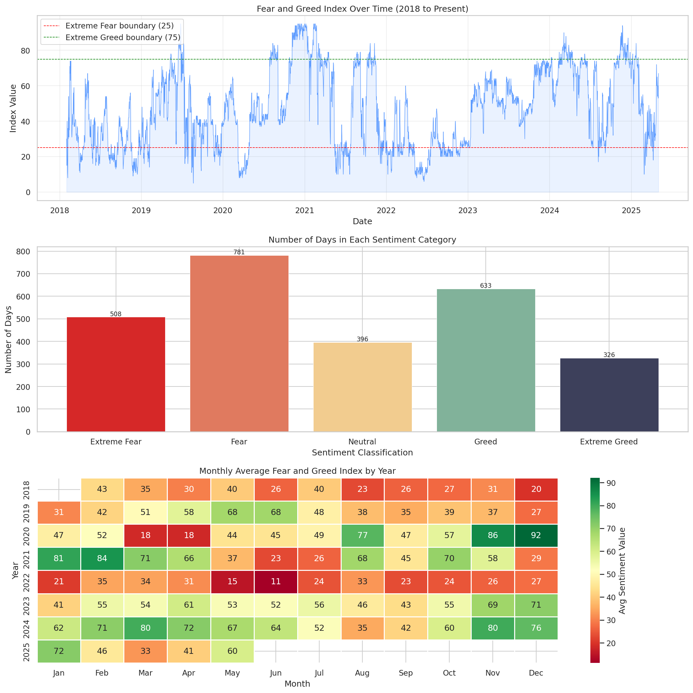
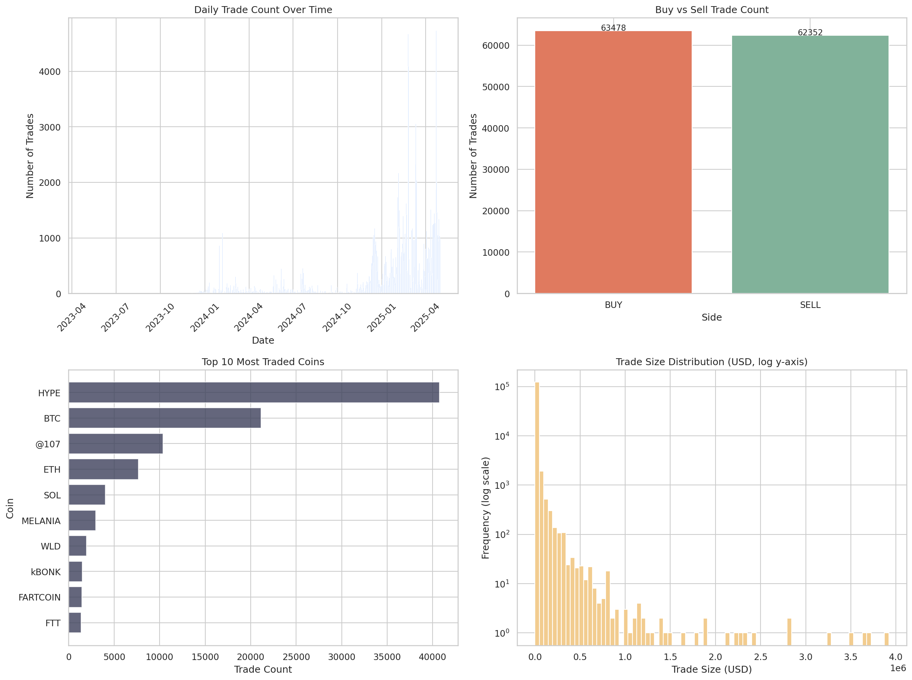
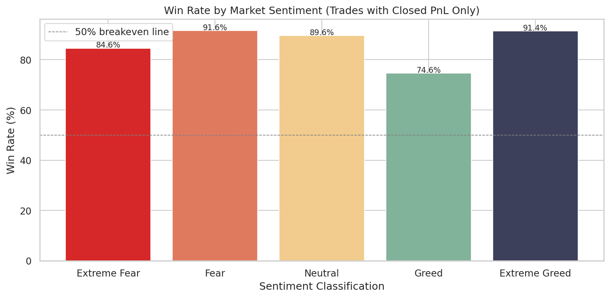
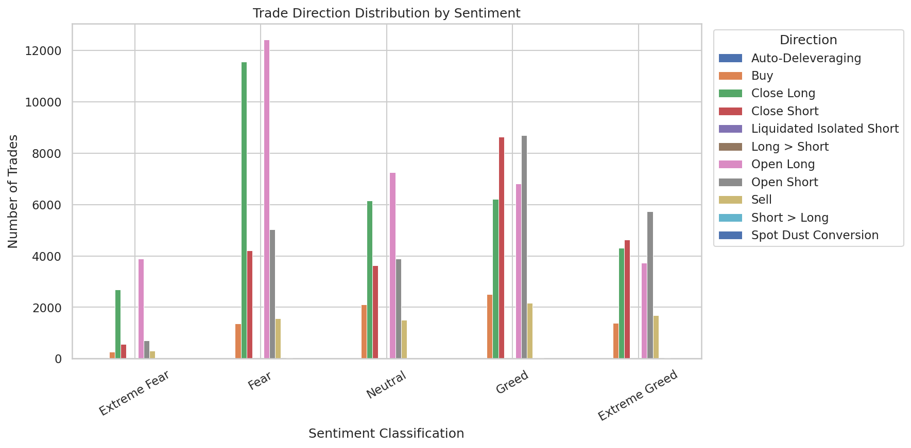
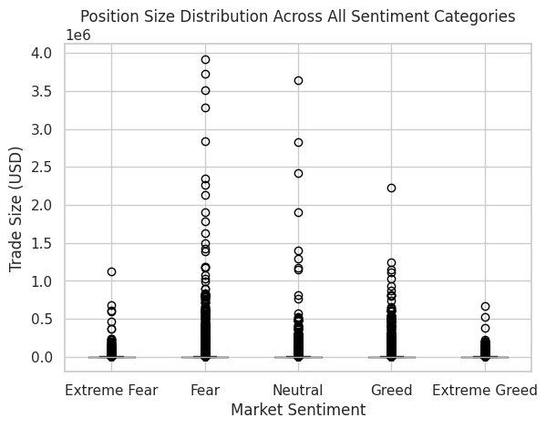
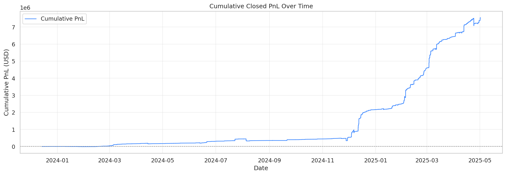
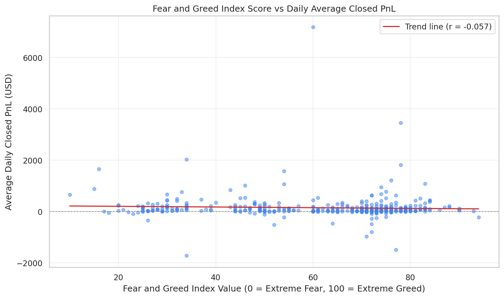
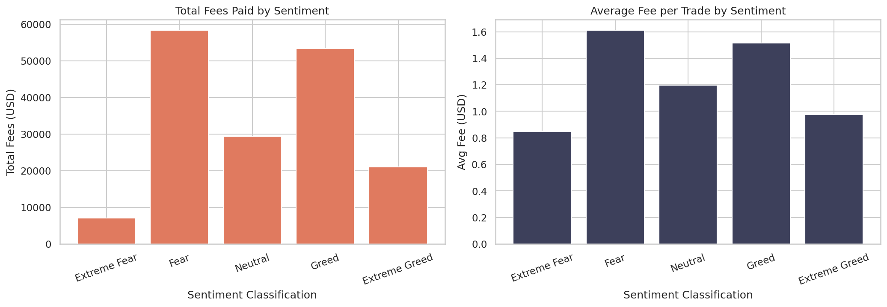
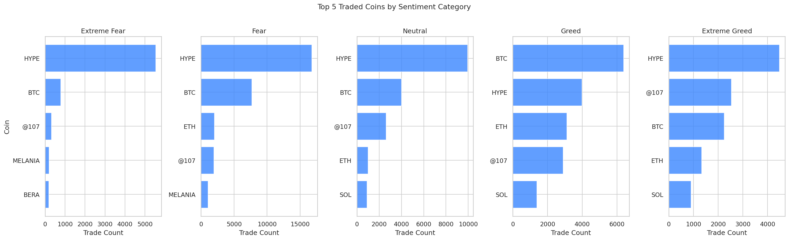

# Hyperliquid Sentiment Analysis
### How the Bitcoin Fear and Greed Index Shapes On-Chain Trading Behavior

---

## Overview

This project investigates whether market sentiment, measured by the Bitcoin
Fear and Greed Index, has a measurable impact on trader behavior and performance
on Hyperliquid, a decentralized on-chain perpetuals exchange.

The analysis covers 125,830 real trades across 19 wallet accounts and 224 coins,
spanning May 2023 to May 2025, merged against 2,644 days of daily sentiment data
from February 2018 to May 2025.

---

## Key Questions

- Do traders perform better during Fear or Greed periods?
- Does sentiment influence whether traders go long or short?
- Are position sizes larger during Fear or Greed?
- Is the sentiment-performance relationship statistically significant?
- Does a higher Fear and Greed score linearly predict daily returns?

---

## Dataset

| Dataset | Rows | Period | Source |
|---|---|---|---|
| Bitcoin Fear and Greed Index | 2,644 days | Feb 2018 to May 2025 | alternative.me |
| Hyperliquid Trade History | 125,830 trades | May 2023 to May 2025 | Hyperliquid Exchange |

The Fear and Greed Index dataset is included in the `data/` folder.
The Hyperliquid trade dataset exceeds GitHub file size limits (45.3MB) and is
not included. Download it directly from Hyperliquid's data export.

---

## Results

### Fear and Greed Index — Historical Overview (2018 to 2025)

The index averaged 46.98 across 2,644 days. Fear was the most common sentiment
(781 days), while Extreme Greed was the rarest (326 days).

---

### Trading Activity Overview

HYPE dominated trading volume across all sentiment periods with 40,725 trades,
followed by BTC (21,149) and ETH (7,662).

---

### Win Rate by Sentiment

| Sentiment | Trades | Win Rate | Avg PnL (USD) |
|---|---|---|---|
| Extreme Fear | 8,403 | 84.58% | 69.69 |
| Fear | 36,200 | 91.60% | 73.78 |
| Neutral | 24,578 | 89.58% | 48.95 |
| Greed | 35,139 | 74.56% | 35.40 |
| Extreme Greed | 21,504 | 91.43% | 85.83 |

Fear and Extreme Greed are the strongest performing sentiment regimes.
Regular Greed is the weakest, with a win rate of just 74.56% and the
lowest average PnL across all five categories.

---

### Trade Direction by Sentiment

During Fear, traders opened 12,413 long positions vs 5,029 short positions,
a long-to-short ratio of 2.5 to 1.

During Greed, this reversed to 8,707 short positions vs 6,813 long positions.
Traders were net short when markets were most optimistic, reflecting a
contrarian strategy that the win rate data confirms was effective.

---

### Position Sizing by Sentiment

| Sentiment | Avg Size (USD) | Std Dev | Max Size (USD) |
|---|---|---|---|
| Extreme Fear | 4,864 | 23,166 | 1,120,972 |
| Fear | 9,367 | 64,343 | 3,921,431 |
| Neutral | 5,622 | 45,169 | 3,641,181 |
| Greed | 6,814 | 34,674 | 2,227,115 |
| Extreme Greed | 4,214 | 13,792 | 665,772 |

Fear periods involve the largest and most variable position sizes, suggesting
high-conviction capital deployment during market stress.

---

### Cumulative PnL Over Time

---

### Sentiment Score vs Daily Average PnL

Spearman correlation between the continuous Fear and Greed score and daily
average PnL returned r = -0.057 with p = 0.252, meaning no statistically
significant linear relationship exists. The relationship is categorical,
not continuous.

---

### Fee Analysis by Sentiment

Fear periods accumulate the highest total fees (58,285 USD) consistent with
higher trade count and larger position sizes. Extreme Fear has the lowest
average fee per trade at 0.85 USD.

---

### Top Coins Traded by Sentiment

HYPE is the dominant coin across every sentiment category, reflecting its
central role in this trader's strategy regardless of market conditions.

---

## Statistical Validation

Mann-Whitney U tests comparing Fear against all other sentiment categories
returned p-values of 0.000000 across the board, confirming that observed
PnL differences are statistically significant and not due to random variation.

| Comparison | U Statistic | p-value | Result |
|---|---|---|---|
| Fear vs Extreme Fear | 28,303,277.50 | 0.000000 | Significant |
| Fear vs Neutral | 102,258,588.50 | 0.000000 | Significant |
| Fear vs Greed | 168,388,956.00 | 0.000000 | Significant |
| Fear vs Extreme Greed | 83,548,142.00 | 0.000000 | Significant |

---

## Conclusion

Market sentiment measurably shapes both how traders behave and how well
they perform on Hyperliquid.

The most dangerous sentiment zone is regular Greed, not the extremes.
Greed produced the lowest win rate (74.56%) and lowest average PnL (35.40 USD),
while Fear (91.60%) and Extreme Greed (91.43%) were the strongest periods.

Sentiment directly flips directional bias. Traders were long-biased during
Fear and short-biased during Greed, consistent with a contrarian approach
that the performance data validates.

Position sizing peaks during Fear at an average of 9,367 USD per trade,
more than double the Extreme Greed average of 4,214 USD, suggesting
high-conviction capital deployment when markets are fearful.

The continuous Fear and Greed score does not linearly predict daily returns.
The sentiment label matters more than the exact score value.

---

## Tech Stack

| Tool | Purpose |
|---|---|
| Python 3.10 | Core language |
| Pandas | Data manipulation and merging |
| NumPy | Numerical operations |
| Matplotlib | Visualizations |
| Seaborn | Statistical plots and heatmaps |
| SciPy | Mann-Whitney U test, Spearman correlation |

---

## Project Structure
